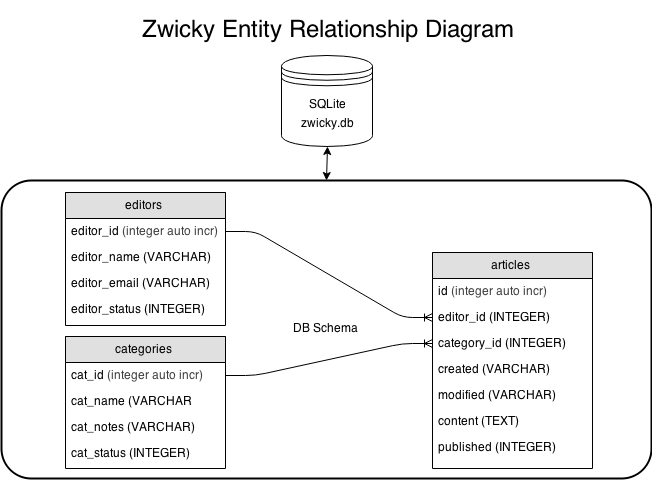

# Zwicky
## An Internally facing Wiki for organizations.
[View Live Demo](http://xavierf.software)
This project is open source:  [View on Github](https://github.com/xavier506/zwicky)

Zwicky has been designed to allow you to create and manage Technical Documentation / Manuals and guides and manuals for software. It's basically a website that allows collaborative editing of its content and structure by its users.

Named in Honor of Fritz

[Fritz Zwicky](http://en.wikipedia.org/wiki/Fritz_Zwicky)
“If ever a competition were held for the most unrecognized genius of twentieth century astronomy, the winner surely would be Fritz Zwicky (1898–1974)” [wikipedia](http://en.wikipedia.org/wiki/Fritz_Zwicky)

# Application Features
### Articles

Articles are documents created by editors and are written in Markdown format. Markdown makes it very easy to read, write, and edit documents. Articles are rendered as HTML a a publishing format; however Markdown is the writing format.

Users may Create Read Update and Delete articles in markdown notation.

### Categories

Categories represent the different projects and topics for which documentation is created. Categories hold documents assigned to related to the same topic.

Users may Create Read Update and Delete categories to organize articles

### Editors

Editors are responsible for writing and maintaining the documents assigned to them. Readers may contact the editor via email if they have any questions regarding their content.

Users may Create Read Update and Delete editors.

# Spec and ERD
The apps diagrams were created using [draw.io](http://en.wikipedia.org/wiki/Fritz_Zwicky) , copies of the diagrams XML files are included in the `docs` folder,

### ERD

### User Flow Chart

## Software Dependencies and Libraries

#### NPM modules installed

Please reference package.json for more details.

* express version : 4.12.3
* sqlite3 version : 3.0.5
* marked version : 0.3.3
* mustache version : 2.0.0
* request version : 2.55.0
* sendgrid version : 1.6.1
* body-parser : 1.12.2
* method-override : 2.3.2
* morgan : 1.5.2

* bootstrap HTML, CSS, and JS framework
